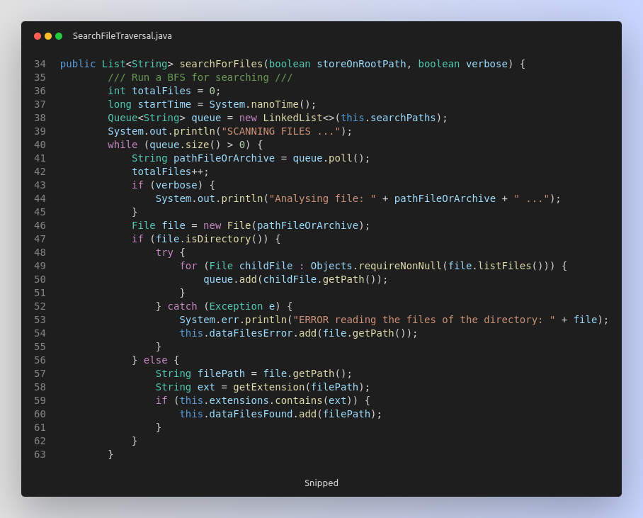
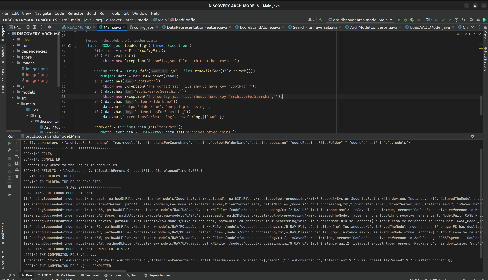

# Discovery and Process Architectural Models 
This is a maven project whose main objective is to search for arch models from a set of file paths 
or web paths to get them, catalog them, get the XMI representation and perform metrics. 
Right now only support the parsing for aadl files, and the search is only done over a file system.

The main objective of this project is to **convert all the previous models found into XMI format**
to use **MDE techniques for future preprocessing**.

The project contains three packages:
1. **discover.arch.model**
2. **osate.standalone.model**
3. **process.model.xmi**

### discover.arch.model: ### 
It contains the classes in charge of processing the path for looking 
for aadl files and the conversion to XMI format. The first step is the search; here, 
we perform a BFS to find the raw models. When the discovery is made, all the paths to 
models are stored in memory and in a .txt file named "files-found.txt".

| Classes             | Description                                                                                                                |
|---------------------|----------------------------------------------------------------------------------------------------------------------------|
| SearchFileTraversal | This class perform the search for arch models given the extensions and the archive that contains the models.               |
| ArchModelConverter  | From a list of path to models, prepare the output directories and convert every model into a XMI model to a xmi directory. |

```text
./models/raw-models/SecuritySystem/syst.aadl
./models/raw-models/SimpleWebServer/ClientServer.aadl
./models/raw-models/UAS/UAS.aadl
./models/raw-models/UAS/UAS_Buses.aadl
./models/raw-models/UAV/Drivers.aadl
./models/raw-models/UAV/FC.aadl
./models/raw-models/UAV/MC.aadl
./models/raw-models/UAV/SW.aadl
./models/raw-models/UAV/UAV.aadl
```
Once you get the list of model paths, the parsing, and conversion into XML starts. 
The class ArchModelConverter takes the list and gets the RawModelLoader Instance that 
map to the extension for the conversion. The subsequent new converted model is stored 
in the disk in the path configured by the userModel. Bellow some examples
```java
ArchModelConverter(String rootPath) throws Exception {
    File file = new File(rootPath);
    if (!file.exists())
        throw new Exception("The rootPath: " + rootPath + "does not exists");
    this.rootPath = rootPath;
    converterModelClassMap.put("aadl", LoadAADLModel.getInstance());
}
```
```java
private void convertModels(boolean verbose) throws Exception {
    int id = 0;
    String outPathXMI = Paths.get(this.rootPath, this.folderOutputName, "xmi") + "/";
    for (String pathFile : this.dataModelFiles) {
        String extension = SearchFileTraversal.getExtension(pathFile);
        if (this.converterModelClassMap.containsKey(extension)) {
            this.convertModelsUsingClass(pathFile, outPathXMI, id + "", verbose);
        } else {
            System.out.println("This converter does not support the mapping between models of " + extension + " to " + " xmi ");
        }
        id++;
    }
}

private void convertModelsUsingClass(String pathFile, String outPathXMI, String id, 
        boolean verbose) throws Exception {
    String extension = SearchFileTraversal.getExtension(pathFile);
    RawModelLoader modelLoader = (RawModelLoader) this.converterModelClassMap.get(extension);
    RawModelLoader.OutputLoadedModelSchema data = modelLoader.loadModel(pathFile, outPathXMI, id, false);
    Map<String, Object> dataOutMap = data.toMap();
    if (verbose)
        System.out.println(dataOutMap);
    dataOutMap.put("extension", extension);
    this.logsOutput.put(new JSONObject(dataOutMap));
}
```

The BFS algorithms for search in the file system



### osate.standalone.model: ###
This package contains the classes in charge of parsing and loading .addl and XMI 
files. This has all the dependencies from OSATE and eclipse EMF. 
The result of parsing these classes is to get the ECORE representation of this model

The classes are:

| Classes                | Description                                                                              |
|------------------------|------------------------------------------------------------------------------------------|
| LoadXMIModel           | Load the .aaxl2 file and return the EObject representation.                              |
| LoadAADLModel          | Load and convert arch models .aadl into XMI instance model .aaxl2. It uses the OSATE api |
| CrossReferenceResolver | Resolve the cross reference models in .aadl files.                                       |


### process.model.xmi: ###
This package takes the path where the XMI processed models are and load the .ecore models from them.
Once we get them, we can perform metrics and some computation and transformation over the models
to collect information about them.

| Classes                   | Description                                                                                                                                                                                  |
|---------------------------|----------------------------------------------------------------------------------------------------------------------------------------------------------------------------------------------|
| Config                    | This class is in charge of loading the required config.json file for getting the path and more configuration vars.                                                                           |
| EcoreModelHandler         | This class is get the list of XMI models from the rootpath stored in config.json and discover all of them. After it get the ecore representation using an instance of class EcoreStandAlone. |
| EcoreStandAlone           | This class return the Ecore models from a path to a XMI model                                                                                                                                |
| DataRepresentationFeature | This class is used for extract feature from analysing the models. Right now it gets the #component ,#connectors and the size of an arch model.                                               |

Main class of the package


## Run Configurations ##
The project contains the following run configurations

| Run Configuration                        | Description                                                                                                                                                                          |
|------------------------------------------|--------------------------------------------------------------------------------------------------------------------------------------------------------------------------------------|
| org.discover.arch.model.Main             | This load the configuration from config.json and perform the discovering architectural models and the conversion into XMI.                                                           |
| org.process.models.xmi.Main              | This get the XMI models and get the ECORE representation of every of them and perform some metric computation.                                                                       |
| org.osate.standalone.model.LoadAADLModel | This is a run configuration to test the conversion of an .aadl arch model into and XMI model. This class uses the OSATE api and EMF API and relay in System Implementations of OSATE |
| org.osate.standalone.model.LoadXMIModel  | Get the ECORE representation of an XMI model previously converted from an arch model.                                                                                                |


### In order to run correctly the above a config.json has to be created
You must create the config.json following this schema, and pass to the static variable the paths
```json
{
  "rootPath":"./models",
  "archivesForSearching": ["raw-models"],
  "extensionsForSearching": ["aadl"],
  "outputFolderName": "output-processing",
  "ecoreRequiredFilesFolder":"./ecore"
}
```
```java
public class Main {
    static String configPath = "./config.json";
    static String rootPath;
    ...
```

In the project an example folder with 6 .aadl models is provided. Once the process of discovering and conversion
is done in the context of the rootPath a directory "output-processing" is created with the resulting 
computation.


| Name                     | Description                                                                                                              |
|--------------------------|--------------------------------------------------------------------------------------------------------------------------|
| rootPath                 | THe rootPath or the global uri in the filesystem where we want to store, all the folder of models and all the logs files |
| archivesForSearching     | An array of folders where we have stored the files we want to process                                                    |
| extensionsForSearching   | An array of extension files that we aim to look for and we aim to convert(The models, ej: addl,ecore, emf)               |
| outputFolderName         | The name of the folder to put the results                                                                                |
 | ecoreRequiredFilesFolder | Contain the path to the ecore folder where a required .ecore models are loaded                                           | 

## Gallery



